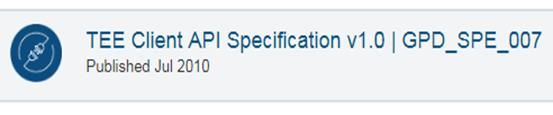
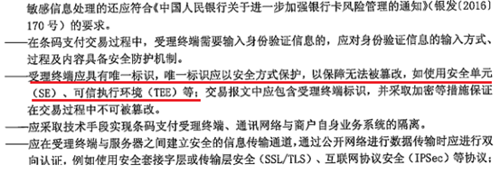

内容来自前辈的文章，链接已经放在文末。

## 一、前言-TEE OS都有哪些厂商 

伴随着Android的发展，TEEOS已成为端侧的基础安全平台，其提供的安全能力为指纹、人脸、支付等多个安全相关的业务服务，而如今都有哪些厂商在做TEE OS呢？


这里列出了18个TEEOS的厂商，在Android手机搭载的TEEOS中，高通的QSEE占比35%、Trustonic&TEEgris占比20%、华为的iTrustee占比17%。下面就基于各个手机厂商的选型来对比一下各个TEE OS解决方案。

### 1、小米 

小米搭载的是高通和MTK的芯片，其TEE OS能力非自研，高通采用的QSEE，MTK采用的是trustonic，但是各个TEE之间兼容性、开放性等等的问题，造成了安全应用的生态闭塞，制约了安全业务的发展。高通QSEE芯片整合能力强，并增加了SPU（Secure Processing Unit）处理器，实现了更高级别的安全，但是其开放性较差，只支持高通芯片，生态业务支持性不好。

反观trustonic，其通过跨平台的SDK屏蔽设备差异，芯片差异，提供应用一致性的编程接口和工具，因此其生态应用拓展丰富，但落地困难，导致应用受限。

### 2、华为 

华为搭载的芯片包括hisi、高通、MTK，采用的iTrustee解决方案，其面向的是全场景，正在成为HMS（华为移动服务）安全生态竞争力基础。

即使有多种规格的设备，通过可信业务接口适配层屏蔽了其差异，实现了接口的归一，从而各个安全业务可以无缝迁移到各个终端设备和平台，实现了跨平台、跨芯片部署，其开放性和兼容性满足了应用的全场景诉求。

### 3、三星 

三星TEEOS从初期的QSEE+Trustonic逐步走向自研化，当前部分芯片已经支持其自研的TEEgris，并对外发布SDK，其TEE OS分为自研和外购两种，同样制约了安全业务的发展，安全生态还处于初期阶段。

### 4、Google 

Google也推出了Android原生配套的TEE OS：Trusty，作为一种可靠且免费的开源替代方案提供给合作伙伴，用于替代其可信执行环境。但是Trusty不支持三方应用开发，其应用只能各个厂商封装在Trusty内核中，再加上Google没有自研的芯片支持，因此生态发展缓慢。

### 5、小结 

TEEOS目前有如此多的厂商在做，但是之间互不兼容，出于各自为政的状态，已经进入存量发展的阶段，其市场份额和手机占比正相关，碎片化及其严重。

虽然有GP规范定义行业标准，但是规范滞后于行业的发展，且封闭繁琐不完整，从而手机厂商参与度不足，没有一家能够完全遵循GP，导致落地困难。再加上垂直的行业联盟，只聚焦于特定的技术方案，没有解决碎片化和易用性的问题，导致安全应用只能在部分高端芯片、高端手机上应用，无法做大安全生态。

因此在全场景的大背景下，以保证安全为前提，只有解决了平台之间、芯片之间的兼容性问题和安全应用的生态开放问题，才能做到安全应用的全场景部署和无缝迁移，从而生态才能够健康的发展。而国家正在着手制定行业标准，《信息安全技术 可信执行环境系统架构》正在征求意见稿，《信息安全技术 可信执行环境服务规范》正在开始制定，可信执行环境国家系列标准有望从顶层设计规范未来技术发展。

## 二、为什么说GP没有解决TEEOS生态碎片化 

通常意义上，大家都认为GP是TEE行业发展过程中一个重要的组织。

如下图所示GP各种数据展示其经过20多年的发展，90多位会员企业，主要聚焦于SE、TEE、TPS三个方向。

  
但GP实际一共只有85家会员单位。大部分都是传统卡商，SE芯片厂商，测试认证厂商等等。（https://globalplatform.org/current-members/）

GP目标是：Develop once and deploy everywhere 一次开发，随意部署！

  
但实际上，从2010年发布第一版API以来，碎片化反而有增无减。

  
GP不是以设备厂商角度来思考标准体系建设,不是以系统架构思想来构建标准体系。

GP在智能卡领域是绝对的权威，这点不假，可是智能卡是一个强监管、封闭实体，与端侧不一样。硬件SE与Trustzone不一样，同样：TEEOS也与COS不同。TEEOS有着强烈的生态开放属性，其生态业务更有着更强算力资源需求。TEEOS与REE侧OS相互关联密切，有着更强的系统安全属性。而不仅仅是一个独立的SE芯片，不基于设备厂商生态思维，从而导致GP制定的一些标准基本从传统智能卡出发经验，不符合移动互联网时代应用生态业务需求和编程习惯。

GP标准滞后于行业发展，比如对TUI接口的支持严重滞后，各TEEOS厂商自己实现私有接口。比如，对有生物识别等硬件接口支持严重滞后，导致各指纹厂商针对高通平台一套实现，麒麟一套实现，还要适配trustonic…豆荚…苦不堪言！

GP直到2018年10月份才更新发布生物识别、外部接口等。而指纹相关应用在2016年已经对TEE有明确诉求，各家只能按照自己的方式去实现接口，何谈兼容！

GP标准封闭繁琐，遵循智能卡体系， TA应用生命周期管理商业模式不明确，接口难用，应用困难。比如，安全应用管理混乱不堪，安全管理框架TMF，之前是叫TA admin,弄了好多年，最近总算与OTrP融合了一版。

比如，各应用厂商都需要定义自己的DeviceID格式,因为GP只有UUID，没有设备的概念。

GP沿用智能卡概念设计太多，不实用不够友好。比如简单的文件存储，干嘛非要persist object？直接文件不就完了？开发者开发TA最后还又要封装成 fs\_open read write close…

GP标准未能反映技术发展趋势，目前没有一家TEE厂商能严格遵守了GP规范，不是不愿意，而且业务需求根本不满足不了，因为卡片操作系统不需要人机交互界面，不需要生态业务。比如，没有定义TA编译配置环境规范，导致各家不兼容，一个指纹厂商要同时针对多家TEEOS开发不同版本的指纹安全应用。比如，没有定义端云一体规范，没有定义云端TEE框架,无法适应未来云端可信执行环境下的安全需求。

GP标准落地约束性不足，安全厂商利益角逐，手机厂商参与度不足，落地困难。除了三星，苹果这些超级大公司之外，广大的手机厂商小米，OPPO，VIVO等手机厂商都没有参与。目前TEE主要部署在手机上，手机终端厂商有着很大的利益诉求，可GP的话语权体系目前并不在终端厂商。

总之，由于GP规范自身问题甚至加重了各厂商存在大量私有API的情况，虽然说后来GP也推出TPS的目的是想统一端云标准，但是其标准本身的碎片化并没有很好解决，而是头痛医头脚痛医脚。

因此GP无法解决生态能力开放体系化，标准化问题。

（这倒是打开了我的新的认知）

## 三、TEE成为央行支付产品种类 

央行发布的《条码支付业务规范（试行）》的通知，包括三个文件：

《条码支付业务规范（试行）》

《条码支付安全技术规范（试行）》

《条码支付受理终端技术规范（试行）》

解读的文章众多，今天这里从技术方面进行学习：

首先我们来看看， 中国人民银行就发布条码支付规范答记者问中有如下

问：针对条码支付技术风险，提出了哪些针对性要求？

答：一是加强条码安全防护。采取支付标记化（Tokenization）、有效期控制、条码防伪识别等手段，提升条码生成、存储、展示、识读、解析、使用等环节的安全防护能力，有效保障条码的可靠性和有效性。

二是提升条码支付交易安全强度。针对不同条码生成方式，提出加密生成、定期更新、终端唯一标识绑定等具有针对性的安全防护措施。要求银行、支付机构和清算机构运用交易验证强度与交易额度相匹配的技术措施提高条码支付交易的安全性。

三是强化条码支付交易风险监测与预警。合理应用大数据分析、用户行为建模等手段建立条码支付风险监控模型和系统，对异常交易及时预警并附加风控措施，对高风险交易及时告知客户资金变化情况。

四是加强客户端软件安全管理。从木马病毒防范、信息加密保护、运行环境可信等方面提升条码支付客户端软件的安全防护能力，要求客户端软件能够监测并向后台系统反馈手机支付环境安全状况并作为风控策略的依据。

这里面明确了提示条码生成、存储、展示、识读、解析等环节的安全防护能力，以及客户端软件的可信环境安全防护能力。

我们知道TEE+SE的基础能力天然具备上述要求，比如应用条码的生成、存储可以在TEE环境中，展示、识读可以在TUI页面完成。

我们理解的客户端软件的可信环境安全防护能力指的是TEE或者SE，目前Android手机上如果不基于TEE技术是无法“可信”！

再来看看《条码支付受理终端技术规范（试行）》：  

也就是说后期的终端设备是强制要求使用TEE或者SE的，我们不难看出

各位同仁看到这里，大家是否明白了什么呢？

1，央行出台了条码支付规范，要求2018年4月1日起实施。

2，中国支付清算协会明出台了支付产品种类，同时明确了引用的标准。2018年1月1日起实施。

3，中国支付清算协会业务主管单位为中国人民银行。

安全已经提示到国家战略层门，央行已经在支付产品安全的具体落实方面，包括在安全技术、产品规范、技术标准等方面对TEE、SE等可信执行环境做出了明确的指示。

参考链接：  
https://developer.huawei.com/consumer/cn/forum/topic/0201884414394540189?fid=0102501639476130680  
https://developer.huawei.com/consumer/cn/forum/topic/0202506006826340101?fid=0102501639476130680